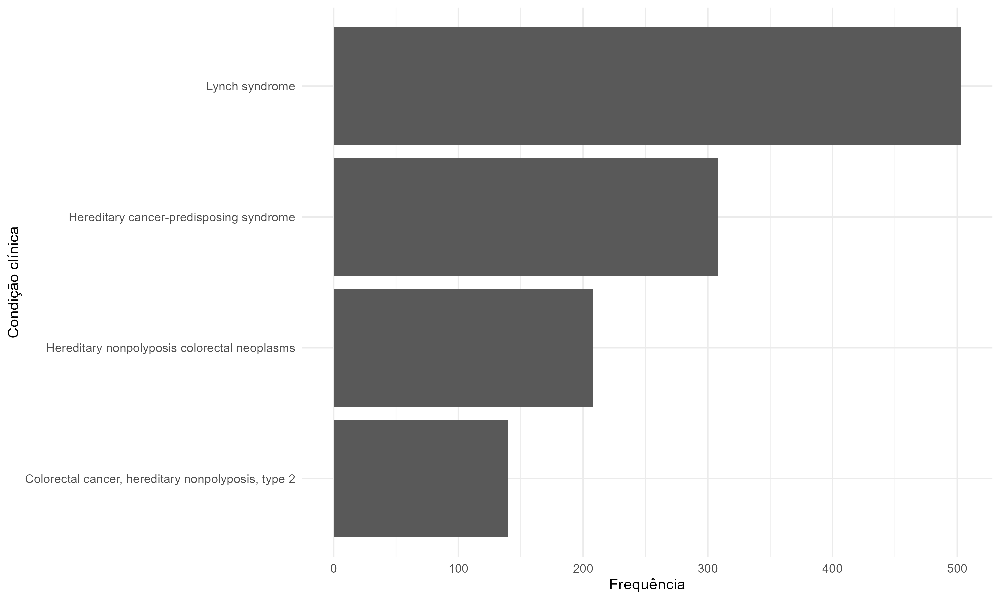

# Relatório de Análise de Variantes MLH1 Associadas à Síndrome de Lynch

## 1. Introdução

A Síndrome de Lynch é uma das principais síndromes hereditárias associadas ao desenvolvimento de câncer, especialmente câncer colorretal e câncer de endométrio. A doença está relacionada a alterações em genes envolvidos no sistema de reparo de incompatibilidades do DNA (DNA mismatch repair), mecanismo responsável por corrigir erros que ocorrem durante a replicação do material genético.

Entre os genes mais frequentemente associados à Síndrome de Lynch encontra-se o MLH1, cuja perda de função pode comprometer a estabilidade genômica e favorecer o acúmulo de mutações ao longo do tempo. Variantes patogênicas nesse gene representam um importante fator de risco para o desenvolvimento de diferentes tipos de câncer hereditário.

O banco de dados ClinVar constitui uma importante fonte pública de informações sobre variantes genéticas e suas interpretações clínicas. A plataforma reúne registros submetidos por laboratórios, instituições de pesquisa e centros clínicos, permitindo a investigação de associações entre variantes genéticas e condições clínicas específicas.

Neste estudo foram analisadas variantes do gene MLH1 classificadas como patogênicas ou provavelmente patogênicas presentes no ClinVar. Foram realizadas etapas de processamento, caracterização clínica, caracterização molecular, análises relacionais e construção de visualizações gráficas, com o objetivo de identificar padrões relevantes associados à Síndrome de Lynch.

## 2. Objetivos

O objetivo deste estudo foi caracterizar variantes do gene MLH1 associadas à Síndrome de Lynch utilizando dados públicos disponibilizados pelo banco ClinVar.

Foram realizadas etapas de importação, limpeza, processamento e análise dos dados, com o objetivo de identificar os 
principais padrões clínicos e moleculares associados às variantes classificadas como patogênicas.

Além disso, foram conduzidas análises relacionais e construídas visualizações gráficas para investigar associações entre condições clínicas, consequências moleculares, tipos de variantes e classificações clínicas presentes no conjunto de dados.

## 3. Materiais e Métodos

### 3.1 Fonte dos dados

Os dados utilizados neste estudo foram obtidos a partir do banco de dados público ClinVar, mantido pelo National Center for Biotechnology Information (NCBI).

Foram selecionados registros associados ao gene MLH1, um dos principais genes envolvidos na Síndrome de Lynch. O conjunto analisado continha informações clínicas e moleculares relacionadas às variantes genéticas depositadas na plataforma.

As informações utilizadas incluíram classificação clínica, condição associada, consequência molecular, tipo de variante, genes relacionados e identificadores das variantes presentes no banco de dados.

### 3.2 Filtragem e processamento

Os dados obtidos no ClinVar passaram por etapas de limpeza e processamento antes das análises.

Inicialmente foram importados para o ambiente R e submetidos a procedimentos de inspeção estrutural, incluindo verificação do número de registros, variáveis disponíveis e presença de informações ausentes.

Em seguida foram selecionadas as variáveis consideradas relevantes para os objetivos do estudo. O conjunto de dados foi filtrado para manter apenas registros associados ao gene MLH1.

Também foram realizadas validações para confirmar a integridade dos dados, incluindo contagem de variantes, verificação de classificações clínicas e conferência das principais características moleculares presentes no banco.

Após o processamento, foi gerado um conjunto de dados limpo e padronizado, utilizado em todas as análises subsequentes.

### 3.3 Ferramentas computacionais

As análises foram realizadas utilizando a linguagem de programação R, amplamente empregada em bioinformática, estatística e ciência de dados.

O ambiente de desenvolvimento utilizado foi o RStudio, que permitiu a organização dos scripts, execução das análises e construção das visualizações gráficas produzidas neste estudo.

O projeto foi estruturado em um fluxo reprodutível contendo diretórios específicos para dados, scripts, resultados, figuras e relatórios. O versionamento do código foi realizado utilizando Git e GitHub, permitindo o registro e rastreamento das diferentes etapas do desenvolvimento do projeto.

### 3.4 Análises realizadas

Foram realizadas análises descritivas e relacionais utilizando os registros do gene MLH1 obtidos no banco ClinVar.

Inicialmente foi conduzida uma caracterização clínica do conjunto de dados, incluindo a distribuição das classificações clínicas, condições associadas e status de revisão dos registros.

Posteriormente foi realizada a caracterização molecular das variantes, contemplando consequências moleculares, tipos de variantes e outras informações biológicas disponíveis no banco de dados.

Também foram conduzidas análises relacionais entre condições clínicas, classificações clínicas, consequências moleculares e tipos de variantes. Os resultados foram organizados em tabelas de frequência e visualizados por meio de gráficos construídos com o pacote ggplot2.

## 4. Resultados

### 4.1 Caracterização clínica

Foram analisados 1.745 registros associados ao gene MLH1 obtidos no banco ClinVar.

A maior parte das variantes encontrava-se classificada como Patogênica (Pathogenic), enquanto uma parcela menor foi classificada como Patogênica/Provavelmente Patogênica (Pathogenic/Likely pathogenic).

As condições clínicas mais frequentemente associadas às variantes analisadas pertenciam ao espectro da Síndrome de Lynch, reforçando a relevância do gene MLH1 na predisposição hereditária ao desenvolvimento de câncer.

A análise das frequências demonstrou predominância de um pequeno grupo de condições clínicas, enquanto diversas outras condições apareceram com menor representação no conjunto de dados.

#### Figura 1. Principais condições clínicas associadas às variantes MLH1

A Figura 1 apresenta as condições clínicas mais frequentemente associadas às variantes do gene MLH1 presentes no conjunto de dados analisado.

### 4.2 Caracterização molecular

A caracterização molecular das variantes revelou predominância de alterações compatíveis com perda de função do gene MLH1.

Entre as consequências moleculares mais frequentes destacaram-se variantes associadas a alterações do quadro de leitura (frameshift), variantes nonsense e alterações em sítios de splicing. Esses mecanismos podem comprometer a produção ou o funcionamento adequado da proteína codificada pelo gene.

A análise dos tipos de variantes demonstrou predomínio de deleções, seguidas por variantes de nucleotídeo único (single nucleotide variants – SNV) e duplicações.

Em conjunto, os resultados indicam que alterações capazes de comprometer a função normal do gene MLH1 representam uma importante fração das variantes associadas à Síndrome de Lynch presentes no banco ClinVar.

### 4.3 Análises relacionais

As análises relacionais permitiram investigar associações entre classificações clínicas, condições clínicas, consequências moleculares e tipos de variantes presentes no conjunto de dados.

A avaliação das relações entre condições clínicas e classificações demonstrou predominância de registros associados à Síndrome de Lynch e condições hereditárias relacionadas à predisposição ao câncer. A maior parte dessas associações encontrava-se classificada como Patogênica.

A análise das consequências moleculares evidenciou o predomínio de mecanismos compatíveis com perda de função do gene MLH1, incluindo alterações do quadro de leitura, variantes nonsense e alterações em regiões de splicing.

Por fim, a análise dos tipos de variantes revelou predominância de deleções, seguidas por variantes de nucleotídeo único e duplicações. Esses resultados reforçam a importância de alterações capazes de comprometer a função normal do gene MLH1 na fisiopatologia da Síndrome de Lynch.

#### 4.3.1 Condição clínica × classificação

A análise da relação entre condições clínicas e classificação das variantes demonstrou forte concentração de registros associados ao espectro clínico da Síndrome de Lynch.

As condições mais frequentes foram Lynch syndrome, Hereditary cancer-predisposing syndrome, Hereditary nonpolyposis colorectal neoplasms e Colorectal cancer, hereditary nonpolyposis, type 2.

A condição Lynch syndrome apresentou a maior frequência observada no conjunto de dados, seguida por síndromes hereditárias relacionadas à predisposição ao câncer e neoplasias colorretais hereditárias.

A predominância dessas condições reforça a relevância biológica do gene MLH1 na predisposição hereditária ao câncer e está de acordo com o conhecimento atualmente descrito para a Síndrome de Lynch.

#### 4.3.2 Consequência molecular × classificação

A análise da relação entre consequências moleculares e classificação clínica revelou predominância de alterações compatíveis com perda de função do gene MLH1.

As consequências moleculares mais frequentes incluíram variantes associadas a alterações do quadro de leitura (frameshift), variantes nonsense e alterações em regiões de splicing.

Esses mecanismos podem resultar na produção de proteínas truncadas, instáveis ou funcionalmente comprometidas, reduzindo a capacidade do sistema de reparo de incompatibilidades do DNA desempenhar adequadamente sua função.

Os resultados observados são compatíveis com o papel biológico do gene MLH1 e reforçam a importância da perda de função como um dos principais mecanismos moleculares associados à Síndrome de Lynch.

#### 4.3.3 Tipo de variante × classificação

A análise da relação entre tipos de variantes e classificação clínica demonstrou predominância de deleções no conjunto de dados analisado.

As deleções representaram a categoria mais frequente, seguidas por variantes de nucleotídeo único (single nucleotide variants – SNV) e duplicações. Outros tipos de variantes, como inserções, indels e microssatélites, também foram identificados, porém em frequências consideravelmente menores.

O predomínio de deleções sugere que alterações estruturais capazes de comprometer a integridade do gene MLH1 representam um mecanismo importante na gênese das variantes classificadas como patogênicas.

Em conjunto, os resultados observados reforçam a importância de alterações associadas à perda de função do gene MLH1 e sua relação com o desenvolvimento da Síndrome de Lynch.

## 5. Discussão

Os resultados obtidos neste estudo são consistentes com o conhecimento atualmente descrito para a Síndrome de Lynch e para o gene MLH1.

A predominância de variantes classificadas como patogênicas sugere que o conjunto de dados analisado é composto principalmente por alterações com relevância clínica já estabelecida. Além disso, a elevada frequência de condições associadas ao espectro da Síndrome de Lynch reforça a importância do gene MLH1 na predisposição hereditária ao desenvolvimento de câncer.

A caracterização molecular revelou predominância de mecanismos compatíveis com perda de função, incluindo alterações do quadro de leitura, variantes nonsense e alterações em regiões de splicing. Esses resultados são biologicamente plausíveis, uma vez que a perda da atividade normal do MLH1 compromete o sistema de reparo de incompatibilidades do DNA e favorece o acúmulo de mutações.

Outro resultado relevante foi a predominância de deleções entre os tipos de variantes observados. Esse padrão sugere que alterações estruturais capazes de comprometer a integridade funcional do gene representam um mecanismo importante na patogênese associada ao MLH1.

Em conjunto, os resultados demonstram que a integração entre análises computacionais, dados públicos e interpretação biológica permite caracterizar de forma consistente os padrões clínicos e moleculares associados às variantes do gene MLH1.

## 6. Conclusão

A análise das variantes do gene MLH1 obtidas no banco ClinVar permitiu identificar padrões clínicos e moleculares consistentes com a fisiopatologia da Síndrome de Lynch.

Os resultados demonstraram predominância de variantes classificadas como patogênicas, forte associação com condições clínicas relacionadas à Síndrome de Lynch e elevada frequência de mecanismos moleculares compatíveis com perda de função do gene.

As análises relacionais evidenciaram a importância de alterações do tipo frameshift, nonsense, splicing e deleções na composição do conjunto de dados analisado.

Além de gerar resultados biologicamente relevantes, este projeto permitiu a construção de um fluxo de trabalho reproduzível em bioinformática, envolvendo importação, processamento, análise, visualização e versionamento de dados genéticos utilizando R, Git e GitHub.

## 7. Referências

1. Landrum MJ, Lee JM, Benson M, et al. ClinVar: improving access to variant interpretations and supporting evidence. Nucleic Acids Research. 2018;46(D1):D1062-D1067.

2. Lynch HT, de la Chapelle A. Hereditary colorectal cancer. New England Journal of Medicine. 2003;348(10):919-932.

3. National Cancer Institute. Lynch Syndrome. Bethesda: National Cancer Institute.
